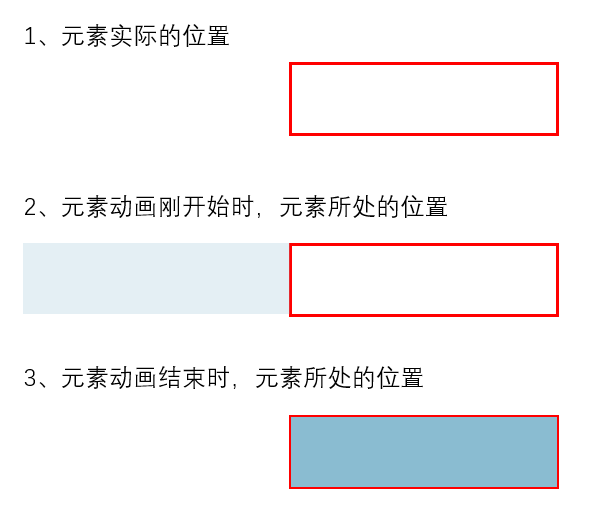

来自：[klh2333 的 github](https://github.com/konglinghao-a/interview_practice/tree/main/css/%E4%BB%8E%E5%B7%A6%E4%BE%A7%E6%B7%A1%E5%85%A5)

## 问题描述

用 CSS 实现从左侧渐入的效果。

## 思路

利用 animation + @keyframes 解决。对于 animation 和 keyframes 的知识点，不熟的话可以看看：[animation](https://developer.mozilla.org/zh-CN/docs/Web/CSS/animation) 和 [@keyframes](https://developer.mozilla.org/zh-CN/docs/Web/CSS/@keyframes)。

在 keyframes 的 0% 处设置透明度为 0 ，初始位置在：相对于**自己实际位置**左移（左移的长度可以是自身的长度）的位置上。

在 keyframes 的 100% 处设置透明度为 1，相对于自身不移动（停在原处）。



## CSS 代码

完整的代码可以看看这里：[这里](https://github.com/konglinghao-a/interview_practice/tree/main/css/%E4%BB%8E%E5%B7%A6%E4%BE%A7%E6%B7%A1%E5%85%A5/code)

具体渐入的效果如下面所示：


```css
/* 从左侧渐入 */
.left-fade-in {
  background-color: rgb(138, 188, 209);
  width: 600px;
  height: 100px;

  /* 定义动画 */
  animation-duration: 1s; /* 动画时间 */
  animation-name: fadein; /* 关键帧名字 */
}

/* 定义关键帧 */
@keyframes fadein {
  0% {
    opacity: 0;
    transform: translateX(-600px);
  }

  100% {
    opacity: 1;
    transform: translateX(0px);
  }
}
```

